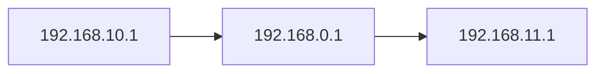

# SMBMap

SMBMap是一个可以使安全审计人员使用此工具进行枚举Samba共享驱动器、列表共享驱动器、驱动器权限、共享内容、上传/下载功能。甚至可以使用SMBMap进行自动下载模式匹配或执行远程命令。

由于该工具设计时考虑到了渗透测试等，旨在简化夸大型网络搜索潜在的敏感数据过程。


_——ShawnDEvans_

---


###### 一，帮助文档

[CN]:翻译

```
usage: smbmap [-h] (-H 主机 | --host-file 文件) [-u 用户名] [-p 密码] [-s 分享] [-d 域] [-P 端口] [-v] [--admin] [-x 命令] [--mode CMDMODE] [-L | -R [路径] | -r [路径]]
              [-A 模式 | -g] [--dir-only] [--no-write-check] [-q] [--depth 深度] [--exclude 分享 [分享 ...]] [-F 模式] [--search-path 路径] [--search-timeout 超时]
              [--download 路径] [--upload 源 ] [--delete 文件路径] [--skip]


可选参数:
-h, --help
显示此帮助消息并退出

主要论点:
-H 主机
主机的IP

--host-file 文件
从文件中枚举主机地址进行扫描

-u 用户名
用户名，如果没有可省略此参数并假定为空会话

-p 密码
密码或NTLM哈希

-s 分享
指定共享（默认C$），例如“C$”

-d 域
域名（默认工作组）

-P 端口  
指定SMB端口，默认为445

-v
扫描对方主机操作系统版本并打印

--admin
如果对方是操作系统管理员则报告此消息


命令执行:
在指定主机上执行命令的选项
-x 命令模式
执行 'ipconfig /all'命令

--mode 命令模式
设置执行方法，wmi或psexec，默认wmi


分片驱动器搜索:
用于搜索/枚举指定主机的共享的选项
-L
列出指定主机上的所有驱动器

-R [文件]
递归地列出目录和文件（没有share\path列出所有共享），例如'C$\Finance'

-r [文件]
列出目录的内容，默认为列出所有共享的根目录，例如-r'C$\Documents和Settings\

-A 模式
定义一个文件名模式（regex），它自动下载匹配的文件（需要-R或-R），而不是cas

-g
使输出grep友好，与-r或-r一起使用(否则它什么也不输出)

--dir-only
只列出目录，普通文件。

--no-write-check
跳过检查，查看驱动器是否授予写访问权限。

-q
安静详细的输出。仅显示您已读取或写入的共享，并在执行搜索(-A)时隐藏文件列表。

--depth 深度
将目录树遍历到特定深度。默认值为5。

--exclude 分享 [SHARE ...]
从搜索和列表中排除共享，例如--排除管理员$C$'


文件内容搜索:
搜索文件内容的选项(必须以根用户身份运行)
-F 模式
文件内容搜索，-F'[Pp]assword'（需要管理员访问权限才能在受攻击主机上执行命令和PowerShell）

--search-path 文件
指定要搜索的驱动器/路径（与-F一起使用，默认为C:\用户），例如'D:\ HR'

--search-timeout 超时
指定文件搜索作业终止前的超时时间(秒)。默认值为300秒。


文件系统交互:
与指定主机的文件系统交互的选项
--download 文件 
从远程系统下载文件。' C $ \ temp \ passwords.txt '

--upload 源 目标
上传文件到远程系统ex。' C$\temp\payload.exe '

--delete 文件路径
删除远程文件，例如。' C$\temp\msf.exe '

--skip 
跳过删除文件确认提示
```


[EN]:官方

```
usage: smbmap [-h] (-H HOST | --host-file FILE) [-u USERNAME] [-p PASSWORD] [-s SHARE] [-d DOMAIN] [-P PORT] [-v] [--admin] [-x COMMAND] [--mode CMDMODE] [-L | -R [PATH] | -r [PATH]]
              [-A PATTERN | -g] [--dir-only] [--no-write-check] [-q] [--depth DEPTH] [--exclude SHARE [SHARE ...]] [-F PATTERN] [--search-path PATH] [--search-timeout TIMEOUT]
              [--download PATH] [--upload SRC DST] [--delete PATH TO FILE] [--skip]

SMBMap - Samba Share Enumerator | Shawn Evans - ShawnDEvans@gmail.com

optional arguments:
  -h, --help            show this help message and exit

Main arguments:
  -H HOST               IP of host
  --host-file FILE      File containing a list of hosts
  -u USERNAME           Username, if omitted null session assumed
  -p PASSWORD           Password or NTLM hash
  -s SHARE              Specify a share (default C$), ex 'C$'
  -d DOMAIN             Domain name (default WORKGROUP)
  -P PORT               SMB port (default 445)
  -v                    Return the OS version of the remote host
  --admin               Just report if the user is an admin

Command Execution:
  Options for executing commands on the specified host

  -x COMMAND            Execute a command ex. 'ipconfig /all'
  --mode CMDMODE        Set the execution method, wmi or psexec, default wmi

Shard drive Search:
  Options for searching/enumerating the share of the specified host(s)

  -L                    List all drives on the specified host
  -R [PATH]             Recursively list dirs, and files (no share\path lists ALL shares), ex. 'C$\Finance'
  -r [PATH]             List contents of directory, default is to list root of all shares, ex. -r 'C$\Documents and Settings\Administrator\Documents'
  -A PATTERN            Define a file name pattern (regex) that auto downloads a file on a match (requires -R or -r), not case sensitive, ex '(web|global).(asax|config)'
  -g                    Make the output grep friendly, used with -r or -R (otherwise it outputs nothing)
  --dir-only            List only directories, ommit files.
  --no-write-check      Skip check to see if drive grants WRITE access.
  -q                    Quiet verbose output. Only shows shares you have READ or WRITE on, and suppresses file listing when performing a search (-A).
  --depth DEPTH         Traverse a directory tree to a specific depth. Default is 5.
  --exclude SHARE [SHARE ...]
                        Exclude share(s) from searching and listing, ex. --exclude ADMIN$ C$'

File Content Search:
  Options for searching the content of files (must run as root)

  -F PATTERN            File content search, -F '[Pp]assword' (requires admin access to execute commands, and PowerShell on victim host)
  --search-path PATH    Specify drive/path to search (used with -F, default C:\Users), ex 'D:\HR\'
  --search-timeout TIMEOUT
                        Specifcy a timeout (in seconds) before the file search job gets killed. Default is 300 seconds.

Filesystem interaction:
  Options for interacting with the specified host's filesystem

  --download PATH       Download a file from the remote system, ex.'C$\temp\passwords.txt'
  --upload SRC DST      Upload a file to the remote system ex. '/tmp/payload.exe C$\temp\payload.exe'
  --delete PATH TO FILE
                        Delete a remote file, ex. 'C$\temp\msf.exe'
  --skip                Skip delete file confirmation prompt
```


###### QA：提示

由于网段问题本次使用以下系统进行实例：


_QA:_

Q:如果你使用不同网段的计算机则SMBMap将会出现<kbd> Authentication error</kbd>身份验证错误。而这个错误是无法避免的就比如：




A:而SMBmap需要经过192.168.0.1的转发，从而数据包需要经过192.168.0.1才能到达192.168.11.1。而SMBMap是一比较死板的专业性SMB分析工具，所以造成了身份验证错误。


##### 二，命令实例

###### 1.基本扫描参数

smbmap -u Administrator -p 123 -H 192.168.11.150

以Administrator及密码123的身份向目标进行检索共享目录信息


smbmap -u Administrator -p 123 --host-file smbmap

从文件中识别IP地址并进行扫描


smbmap -u Administrator -p 123

以<kbd>Administrator</kbd>及密码<kbd>123</kbd>的身份对目标进行扫描共享文件，否则将会发生身份错误。


smbmap -u Administrator -p 123 -s ADMIN$ -H 192.168.11.150

扫描目标中是否有ADMIN$共享，并且扫描对方所有开启的共享目录


smbmap -u Administrator -p 123 -d workgroup -H 192.168.11.150

指定扫描工作组为<kbd>workgroup</kbd>，默认工作组为<kbd>workgroup</kbd>


smbmap -u Administrator -p 123 -P 520 -H 192.168.11.150

设置SMB指定端口为<kbd>520</kbd>进行扫描，SMB默认端口为<kbd>445</kbd>


###### 2.命令执行

smbmap -u Administrator -p 123 -H 192.168.11.150 -x ipconfig

在目标主机中远程执行ipconfig命令并将输出结果打印

> 不仅仅局限与ipconfig，你也可以使用其他命令，比如<kbd>dir</kbd>
>
> 


smbmap -u Administrator -p 123 -H 192.168.11.150 -L

列出对方主机内的所有磁盘信息

> 


###### 3.共享与扫描

smbmap -u Administrator -p 123 -H 192.168.11.150 -R C$

列出对方C$磁盘中的所有共享文件


smbmap -u Administrator -p 123 -H 192.168.11.150 -r C$

列出共享根目录

> 与<kbd>-R</kbd>参数区别是-R参数列出所有共享文件及目录，而<kbd>-r</kbd>列出的只是该磁盘下的共享文件及根目录


smbmap -u Administrator -p 123 -q -R C$ -H 192.168.11.150

简洁输出，只输出扫描磁盘内是否有已读取或可写入共享目录


smbmap -u Administrator -p 123 -q -r C$  -A web -H 192.168.11.150

下载目标主机内共享磁盘C中的web文件并简要输出内容


smbmap -u Administrator -p 123 -H 192.168.11.150 --depth 1

设置扫描深度为<kbd>1</kbd>默认扫描深度为“5”


###### 4.下载与上传

smbmap -u Administrator -p 123 -A web -r C$ -H 192.168.11.150

在对方磁盘C中寻寻找共享文件并下载所有web格式文件

> <kbd>-A</kbd>参数主要有： web，global，asax ，config 几种模式，分别为：
>
> web:下载web文件
>
> 
>
> 
>
> global:下载全部文件
>
> asax:下载asax格式文件
>
> config:下载config格式的配置文件
>
> 


smbmap -u Administrator -p 123 -H 192.168.11.150 --download web.html

远程下载web.html文件


smbmap -u Administrator -p 123 -H 192.168.11.150 --upload /smbmap/Hello.html C$/WINDOWS/hello.exe

将<kbd>smbmap/Hello.exe</kbd>文件上传到目标主机<kbd>C:\\\\WINDOWS</kbd>目录中并重命名为<kbd>hello.exe</kbd>


smbmap -u Administrator -p 123 -H 192.168.11.150 --delete C$/WINDOWS/hello.exe

远程删除<kbd>C//WINDOWS/hele.exe</kbd>文件


submap -u Administrator -p 123 -H 192.168.11.150 --delete C$/WINDOWS/hello.exe

删除文件但不做验证其文件<kbd>是否删除</kbd>

> 对于不加<kbd>--skip</kbd>参数和加上该参数最明显的就是在于数据包中，你可以理解为加上<kbd>--skip</kbd>参数只发送一个数据包从而结束（FIN）。
>
> 而不加上<kbd>--skip</kbd>则会有两次数据包，一次发送一次回应。
>
> 


