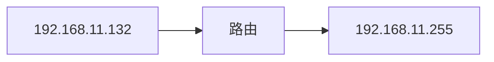

# Hping3

hping3是一个能够发送自定义TCP/IP的网络工具，信息包和显示目标应答，就像ping一样ICMP回复。hping3可以处理碎片，并且几乎任意数据包大小和内容，使用命令行界面，并且在Hping3开始，已经开始支持脚本使用了。

_——antirez@invece.org_

---

 #### 一，帮助手册

[中文]:翻译

用法：hping3 host[选项]
-h—帮助显示此帮助
-v—版本显示版本
-c—计数数据包计数
-i——间隔等待（uX为X微秒，例如-i u1000）
---i u10000的快速别名（10包每秒）
--更快的别名-i u1000（100包每秒）
--以最快的速度发送数据包。不显示答复。
-n—数值输出
-q—安静
-I——接口接口名称（否则为默认路由接口）
-V—详细详细模式
-D—调试信息
-z—将ctrl+z绑定到ttl（默认为dst端口）
-Z—取消绑定取消绑定ctrl+Z
--接收到的每个匹配数据包的蜂鸣音
模式
默认模式TCP
-0—rawip原始IP模式
-1—icmp icmp模式
-2—udp-udp模式
-8——扫描扫描模式。
示例：hping--scan 1-30,70-90-S www.target.host
-9——监听模式
知识产权
-a—欺骗源地址
--随机目标地址模式。看那个人。
--随机源地址模式。看那个人。
-t—ttl ttl（默认64）
-N—id id（默认随机）
-W—win id使用win*id字节排序
-r—rel relatifize id字段（用于估计主机流量）
-f—将数据包分成多个碎片。（可能通过弱acl）
-x—morefrag设置更多片段标志
-y—dontfrag set不分段标志
-g——fragoff设置片段偏移量
-m——mtu设置虚拟mtu，表示——frag if packet size>mtu
-o--tos服务类型（默认0x00），try--tos帮助
-G--ROUTE包含记录路由选项并显示路由缓冲区
--lsrr松散源路由和记录路由
--ssrr严格源路由和记录路由
-H--ipproto设置IP协议字段，仅在原始IP模式下
ICMP公司
-C—icmptype icmp类型（默认回显请求）
-K—icmpcode icmp代码（默认为0）
--强制icmp发送所有icmp类型（默认仅发送支持的类型）
--icmp gw设置icmp重定向的网关地址（默认为0.0.0.0）
--icmp ts别名--icmp--icmptype 13（icmp时间戳）
--icmp addr别名--icmp--icmptype 17（icmp地址子网掩码）
--icmp帮助显示其他icmp选项的帮助
UDP/TCP协议
-s—基本端口基本源端口（默认随机）
-p--destport[+][+]<port>目标端口（默认为0）ctrl+z inc/dec
-k—保持源端口不变
-w—winsize（默认64）
-O——tcpoff设置假tcp数据偏移量（而不是tcphdrlen/4）
-Q—seqnum只显示tcp序列号
-b——badcksum（尝试）发送IP校验和错误的数据包
许多系统将修复发送数据包的IP校验和
所以你会得到坏的UDP/TCP校验和。
-M—setseq设置TCP序列号
-L—设置TCP ack
-F—fin集合fin标志
-S—syn设置syn标志
-R—重新设置重新设置标志
-P—推集推标志
-A—ack集合ack标志
-U—urg设置urg旗
-X—xmas设置X未使用标志（0x40）
-Y—ymas设置Y未使用标志（0x80）
--tcp exit code使用最后一个tcp->th_标志作为退出代码
--tcp mss启用具有给定值的tcp mss选项
--tcp timestamp启用tcp timestamp选项来猜测HZ/uptime
普通的
-d—数据数据大小（默认为0）
-E—文件中的文件数据
-e—签名添加“签名”
-j—转储十六进制数据包
-J—打印转储可打印字符
-B——安全启用“安全”协议
-u--end告诉您--file何时到达EOF并防止倒带
-T—traceroute traceroute模式（表示--bind和--ttl 1）
--在traceroute模式下接收第一个非ICMP时tr stop Exit
--tr keep ttl keep the source ttl fixed，仅用于监视一个跃点
--tr no rtt在traceroute模式下不计算/显示rtt信息
ARS数据包描述（新的，不稳定的）
--apd发送用apd描述的数据包（见docs/apd.txt）

[EN]:官方

usage: hping3 host [options]
  -h  --help      show this help
  -v  --version   show version
  -c  --count     packet count
  -i  --interval  wait (uX for X microseconds, for example -i u1000)
      --fast      alias for -i u10000 (10 packets for second)
      --faster    alias for -i u1000 (100 packets for second)
      --flood      sent packets as fast as possible. Don't show replies.
  -n  --numeric   numeric output
  -q  --quiet     quiet
  -I  --interface interface name (otherwise default routing interface)
  -V  --verbose   verbose mode
  -D  --debug     debugging info
  -z  --bind      bind ctrl+z to ttl           (default to dst port)
  -Z  --unbind    unbind ctrl+z
      --beep      beep for every matching packet received
Mode
  default mode     TCP
  -0  --rawip      RAW IP mode
  -1  --icmp       ICMP mode
  -2  --udp        UDP mode
  -8  --scan       SCAN mode.
                   Example: hping --scan 1-30,70-90 -S www.target.host
  -9  --listen     listen mode
IP
  -a  --spoof      spoof source address
  --rand-dest      random destionation address mode. see the man.
  --rand-source    random source address mode. see the man.
  -t  --ttl        ttl (default 64)
  -N  --id         id (default random)
  -W  --winid      use win* id byte ordering
  -r  --rel        relativize id field          (to estimate host traffic)
  -f  --frag       split packets in more frag.  (may pass weak acl)
  -x  --morefrag   set more fragments flag
  -y  --dontfrag   set don't fragment flag
  -g  --fragoff    set the fragment offset
  -m  --mtu        set virtual mtu, implies --frag if packet size > mtu
  -o  --tos        type of service (default 0x00), try --tos help
  -G  --rroute     includes RECORD_ROUTE option and display the route buffer
  --lsrr           loose source routing and record route
  --ssrr           strict source routing and record route
  -H  --ipproto    set the IP protocol field, only in RAW IP mode
ICMP
  -C  --icmptype   icmp type (default echo request)
  -K  --icmpcode   icmp code (default 0)
      --force-icmp send all icmp types (default send only supported types)
      --icmp-gw    set gateway address for ICMP redirect (default 0.0.0.0)
      --icmp-ts    Alias for --icmp --icmptype 13 (ICMP timestamp)
      --icmp-addr  Alias for --icmp --icmptype 17 (ICMP address subnet mask)
      --icmp-help  display help for others icmp options
UDP/TCP
  -s  --baseport   base source port             (default random)
  -p  --destport   [+][+]<port> destination port(default 0) ctrl+z inc/dec
  -k  --keep       keep still source port
  -w  --win        winsize (default 64)
  -O  --tcpoff     set fake tcp data offset     (instead of tcphdrlen / 4)
  -Q  --seqnum     shows only tcp sequence number
  -b  --badcksum   (try to) send packets with a bad IP checksum
                   many systems will fix the IP checksum sending the packet
                   so you'll get bad UDP/TCP checksum instead.
  -M  --setseq     set TCP sequence number
  -L  --setack     set TCP ack
  -F  --fin        set FIN flag
  -S  --syn        set SYN flag
  -R  --rst        set RST flag
  -P  --push       set PUSH flag
  -A  --ack        set ACK flag
  -U  --urg        set URG flag
  -X  --xmas       set X unused flag (0x40)
  -Y  --ymas       set Y unused flag (0x80)
  --tcpexitcode    use last tcp->th_flags as exit code
  --tcp-mss        enable the TCP MSS option with the given value
  --tcp-timestamp  enable the TCP timestamp option to guess the HZ/uptime
Common
  -d  --data       data size                    (default is 0)
  -E  --file       data from file
  -e  --sign       add 'signature'
  -j  --dump       dump packets in hex
  -J  --print      dump printable characters
  -B  --safe       enable 'safe' protocol
  -u  --end        tell you when --file reached EOF and prevent rewind
  -T  --traceroute traceroute mode              (implies --bind and --ttl 1)
  --tr-stop        Exit when receive the first not ICMP in traceroute mode
  --tr-keep-ttl    Keep the source TTL fixed, useful to monitor just one hop
  --tr-no-rtt       Don't calculate/show RTT information in traceroute mode
ARS packet description (new, unstable)
  --apd-send       Send the packet described with APD (see docs/APD.txt)

---

#### 二，命令实例

hping3 -v

显示当前版本

hping3 -c 10 192.168.11.136

仅对目标发送10次请求包

---

__洪水攻击__

在泛定的广义上来讲，子要网络数据包发送量过大时，就会造成洪水攻击，常见的洪水攻击如DDoS，ARP等。

_相关原理_

攻击者往往会使用多台PC主机或服务器对目标进行攻击，而这个攻击则就是向目标发发送微秒级的数据请求，这可能会造成目标主机的无法访问或服务器资源耗尽等，而这个攻击是无法防御的，对方服务器可做操作（常见）有：

>  1.对目标IP进行封禁
>
> 一般有些网站或服务器会设置一个在一段时间内的访问次数，比如十分钟内凡是来自你的数据包汗你特征的，比如IP，MAC这些，会将你短暂的封禁，导致你的无法访问。
>
> 2.服务器进行分流
>
> 服务器分流是一种DDoS攻击常见的方法，使用多个服务器以提高整体的性能，当对方服务器只有10台的时候，那么你发送的数据包将会分散在这十台服务器之间，比如你发送的是5个请求包，Server_id1 接受的请求包为3，Server_id2接受的请求包为2，那么你的数据包就会完全的分散，除非攻击者增量攻击，否则攻击者将会失败
>
> 3.提高服务器性能
>
> 提高服务器整体性能是一个非常耗材的办法，比如此时USER1购买的是某云学生机，那么攻击者只需要等待积分在即可达到目的。
>
> 但是如果目标购买的是某云高防服务器则攻击者很难达到攻击，只是因为服务器的性能不同和宽带数量而决定的。
>
> > 什么是宽带？
> >
> > 宽带，英文名词为“Broadband”，在电子通信等领域上，主要用来描述路线能够同时处理宽带的范围和频率。
> >
> > 我们拿一个最简单的例子来描述，加入你是一个车主，有一个五星级加油站和三星级的加油站，而五星级的加油站有5个加油口，但是三星级的加油站有2个口。你作为车主想马上踏上行程的话，去三星级的加油站需要排队，但是价格更低，实惠。
> >
> > 那么你也可以选择五星级的加油站，五星级的加油站可以为你提供优质的服务，并且不用等待，开过去就可以加油。
> >
> > 那么你作为车主，你会选择那个?

---

hping3 -i u100 192.168.11.136

设置请求间隔（单位：100）

> 旗下还附带了三条命令
>
> > 可搭配 --rand-source （随机使用一个IP地址）
>
> --fast -u10000	//在10000微秒内每秒发送10个
>
> --faster -i u1000 //在1000微秒内快速发送，每秒发送100个包
>
> hping3 -i u --flood 192.168.11.135	//以最可能的最快的速度发送数据包，并且不打印输出

hping3 -n 192.168.11.136

以目标需要的形式输出

hping3 -q 192.168.11.136

不打印结果但正常发送数据包

hping3 -I vmnet8 192.168.11.136

使用vmnet8网卡接口对192.168.11.136进行扫描

hping3 -V 192.168.11.136

详细的打印192.168.11.136的扫描结果

hping3 -D 192.168.11.136

将最终结果设置为调试模式

hping3 -z 192.168.11.136

使用“ctrl+z”键来绑定该数据包的生存时间“ttl”

hping3 -Z 192.168.11.136

取消绑定 ctrl + z

heping3 --beep 192.168.11.136

当切换或其他窗口时则提醒结果

---

__Mode（模式）__

hping3 -0 192.168.11.136

使用源IP模式对目标进行扫描

hping3 -1 192.168.11.136

使用ICMP协议对192.168.11.136进行检索

hping3 -2 192.168.11.136

使用UDP模式对目标进行检索

hping3  -8 100-200,200-30 zsdk.org.cn

扫描zsdk.org.cn端口范围为100~200,200~300[^演示部分撒谎哦写了一个0]

hping3 -9 192.168.0.102

监听192.168.0.102发送是SYN数据包

----

__IP__

hping3 -a 192.168.11.132 255.255.255.0

对源IP地址进行欺骗

> 伪造虚假的IP地址对目标发送数据包，使得攻击者可隐藏自身IP地址，冒充任何计算机（IP）
>
> 其原理是路由只转发IP地址，并不对源地址进行验证

hping3 -I wlan0 --rand-dest 192.168.11.136

随机目标地址模式

hping3 -rand-source 192.168.11.136

使用一个随机的IP对目标发送数据包

hping3 -t 10 192.168.11.136

设置发送输出包的生存时间为“10”[^默认为64]

hping3 -f 192.168.11.136

将数据包分割为更多的数据包[^可能会通过ACL（Access Control List ,访问控制协议）]

hping3 -x 192.168.11.136 

设置更多的碎片标志

> hping3 -y 192.168.11.136 //碎片标志

> 
>
> 
>
> hping3 -g 10 192.168.11.136
>
> 设置一个偏移量为10[^可能是我的思路或者技术问题，没有设置成功]
>
> 
>
> 
>
> [此参数于2020年4月16日无法使用,如果有解决方法请联系我]:backsunlil@yeah.net

> hping3 -o telnet 192.168.11.136
>
> 使用telnet服务类型发送数据包 [^hping3官方为此提供了一个帮助手册，可使用命令 hping3 try --tos help 进行查看]
>
> 
>
> 
>
> [此参数与2020年4月15日无法使用，如果您有解决方法请联系我]:backsunli@yeah.net

hping3 -G 192.168.11.136

包括RECORD_ROUTE（记录路由）选项并显示路由缓冲区

> __Record route__
>
> 记录路由（Record route）：数据包离开时为每台机器提供空间记录数据包的出站接口地址，便于保存数据包经过的所有路由器的记录，类似与路由追踪，但是和路由追踪不同
>
> 
>
> 路由记录（Record route）：当IP离开路由器的时候记录路由器的出站IP接口地址
>
> 
>
> 路由记载（Record route）：fast路由ip地址，当IP包脱节到每个路由器的时间记载路由器的出站接口地址。
>
> 
>
> 记录路由选项（Record route）当报文离开时为每个路由器提供空间记录报文的出站接口地址，以便保存保温经过的所有路由器记录
>
> 
>
> __路由缓冲区__
>
> 在数据包中添加了相应的驱动和缓冲模块，避免了数据的冲突，完美的保障了数据的完整性。

hping3 --less 192.168.11.255 192.168.11.136

使用松散源路由和记录路由对目标发送数据包

hping3 --ssrr 192.168.11.255 192.168.11.136

> __松散源路由（loose source route）__
>
> 松散源路由，通俗的来说是你给出一个目标（IP地址），不管用什么方法，只需要经过这个路由就可以了。
>
> 
>
> __严格源路由（strict rucre route）__
>
> 严格源路由，通俗上说，他严格的规定了路由要经过的路径上的每一个路由器，经过路由的顺序也不可更改，与“松散源路由（loose source route）的区别是松散源路由只需要经过指定的路由即可。
>
> 而严格路由，需要你把该过的流程都过了，都过一遍，才可以”

hping3 -H 192.168.11.255 192.168.11.136

仅在原始IP模式下设置IP协议字段

---

__ICMP__

hping3 -C vmnet8 192.168.11.136 

使用ICMP协议模式向目标发送数据包[^vmnet为该网段所使用的网卡，可使用“-V”参数进行查看]

hping3 -K 192.168.11.136

设置ICMP代码为“10”

> hping3 -K --force-icmp 192.168.11.136
>
> 发送所有ICMP类型（Hping目前所支持的）
>
> 

hping3 --icmp-gw 192.168.11.136 192.168.11.123

重定向网关地址到192.168.11.202[^hping3默认重定向网关到0.0.0.0]

hping3 --icmp-ts 192.168.11.136

设置ICMP类型为“13”的时间戳请求

hping3 --icmp-addr 192.168.11.136

设置ICMP类型为“17”的时间戳请求

> hping3 --icmp-ipver 2 192.168.11.136
>
> 修改发送数据包的IP协议版本为“2”[^默认“4”]
>
> 
>
> 
>
> hping3 --icmp-iplen 10 192.168.11.136
>
> 设置IP总长度为“10”
>
> 
>
> hping3 --icmp-ipid 10 192.168.11.136
>
> 设置ip总长度[默认随机]
>
> 
>
> hping3 --icmp-srcport 23 
>
> 设置源端口为“23” [^默认随机]
>
> 
>
> 
>
> hping --icmp-dstport 43 192.168.11.136
>
> 设置目标端口为"43"
>
> 
>

hping3 --icmp-ipproto 192.168.11.255 192.168.11.136

设置IP协议[^默认为"IPPROTO_TCP"]

> “IPPROTO_TCP”与“IPPROTO_IP”分别代表了TCP协议和IP协议。

_hping3 --icmp-ipsrc 192.168.11.255 192.168.11.136_

_设置IP地址源[^默认0.0.0.0]_

hping3 --icmp-ipdst 192.168.11.255 192.168.11.134

设置目标地址为192.168.11.134

 hping3 -icmp-cksum 192.168.11.136

集合icmp校验和[^默认为正确的cksum]

> cksum是一种排错检查方式，由CCITT所制定的演算标准。至少可以检测到99.998%的已知错误。

---

__UDP/TCP__

hping3 -s 73 192.168.11.136 

设置基本源端口地址为73,之后随着数据包的增加而增加端口数

> > 源端口就是一个数据包的出口地址，比如你从A门出去，则你的源地址是A，如果你的女朋友从B们出去，那么你的女朋友的源地址就是B。
> >
> > 而设置源IP地址就是设置你出入的门，此处我们吧数据包的出口地址设置为了73，而”-s“参数有一个非常便捷的功能，加入我们设置的源端口为”73“，那么第一个数据包序号为0 的源端口一定是73，而第二个数据包序号为1的源端口一定为74，第三个数据包序号3的一定为75，以此类推。
>
> 

hping3 -p 73 192.168.11.136

目标端口为73，并向目标发送数据包，通过 ctrl+z 键进行增/减端口

> lnc，全称 “progressive increase”中文译名为 递增和递减。
>
> dec，全称”decrease progressively“中文译名为 逐渐增加

hping3 -k 192.168.11.136

保持源端口不动[^假如源地址为2748，则数据包所有hping3请求的源地址都为2748端口]

hping3 -w 520 192.168.11.136

设置窗口大小为520[^Windows是窗口的意思，而size就是大小的意思，组合为”窗口大小“]

> hping3 -O 10 192.168.11.136
>
> 设置虚拟TCP偏移量
>
> 
>
> 
>
> hping3 -Q 192.168.11.136
>
> 仅显示TCP序列号
>
> > TCP是一种可靠的面向连接的数据流协议，TCP之所以可靠是因为他保证了传输包的顺序。而顺序是由序列号所来保证的，请求包，响应包中都包含了序列号。
>
> 

hping3 -q 192.168.11.136

尽可能的发送校验值错误的数据包

> 许多系统会修正发送数据包的IP校验和，所以你会得到错误的UDP/TCP校验和((try to) send packets with a bad IP checksum many systems will fix the IP checksum sending the packet so you'll get bad UDP/TCP checksum instead.)

hping3 -M 5201314 192.168.11.136

将TCP序列号自定义为”5201314“[^和女朋友的硬核表白]

---

 

__TCP三次握手__

HOST A需要与HOSTB建立连接，则需要发送一个 SYN请求（seq =x，顺序号码）发放至HOST B，HOST B收到HOST A的SYN数据后发送数据为（seq =y，顺序号码 ，ACK(来表示确定收到数据包)），之后HOST A发送数据（ACK = y+1，来表示已经确定收到数据）之后HOST B 已经知道了HOST A收到了”我“发送的数据。

---

__Flags__

hping3 -L 520 192.168.11.136

设置TCP ACK（Acknowledgement，确认字符）

> TCP ACK全称为（Acknowledgement）即确认字符，在数据通信中，接受站发给发送站的一种传输类控制字符。用于表示已经发来的数据以确认接受无误。
>
> 而ACK信号一般为为ASCII字符，在不同协议之中，ACK信号并不是一样的。

hping3 -S 192.168.11.136

设置SYN（Synchronize Sequence Numbers）标志[^主要建立连接]

> SYN全称（Synchronize Sequence Numbers）中文译名为同步序列编号，是TCP/IP建立连接是所使用的握手信号。在客户机和服务器之间建立正常的TCP网络连接时，客户机首先需要发送一个SYN信息，服务器收到了在使用SYN/ACK来应答此消息

hping3 -R 192.168.11.136

设置RST（Reset）重置连接标志[^主要用于重置连接]	

hping3 -P 192.168.11.136

设置Push标志[^表示有数据传输]

hping3 -F 192.168.11.136

设置Fin标识[^表示关闭连接]

hping3 -A 192.168.11.136

设置ACK（Acknowledgment）模式[^表示响应]

> ACK（Acknowledgement），中文译名为”却热字符“，在数据的通信中，用于接受对方发送的请求，用于确认数据已经成功发放，通常ACK数据为ASII信号。

hping -U 192.168.11.136

设置URG（Urgent，紧急）标志

hping3 -X 192.168.11.136

设置X个为使用标志

hping3 -Y 192.168.11.136

设置y个为未用标志

hping3 --tcpexitcode 192.168.11.136

使用TCP_Flags作为推出码

hping3 --tcp-mss 192.168.11.136

设置MSS（Maximum segment size）最大值，并启用MSS选项

> MSS，全称为”Maximum segment size“即最大报文长度。在发送SYN连接时，同时将MSS发送给对方，而MSS紧紧只会出现在SYN之中，而MSS主要的作用就是告诉对方最大的报文长度。
>
> > 在网络传输数据时，数据最终需要交付到链路层协议，最后需要伪装车个一个”帧“。而帧的大小如果超过了1500字节，则需要进行分片，而且这个是必须要做的。

hping3 --tcp-timestamp 192.168.11.136

允许TCP时间戳选项猜测

---

__Common（模式）__

hping3 -d 521 192.168.11.136

设置数据包TCP段（TCP Segment Len）大小为“521”

> -E
>
> 数据文件
>
> 
>
> -e
>
> 添加TCP签名
>
> 
>
> -B
>
> 启用安全协议
>
> -u
>
> 告诉你文件什么时候到达，并防止文件倒带

hping3 -j 192.168.11.136 

转换为十六进制数据包[^O.o']

hping3 -J 192.168.11.136

输出为可打印字符

> hping3 -T 
>
> 暗指--bind和--ttl
>
> 
>
> --tr-stop
>
> 在traceroute模式下，如果接收到了ICMP协议的情况下，自动推出 --tr-stop
>
> 
>
> --tr-keep-ttl
>
> 保持一个源ttl固定
>
> 

---

#### 附件1 命令组合

_查看数据包_

hping3 -j -J 192.168.11.136

可显示发送时数据包的16进制和大部分信息

